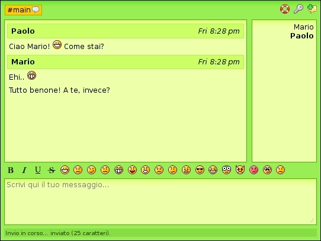
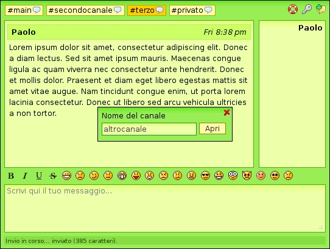
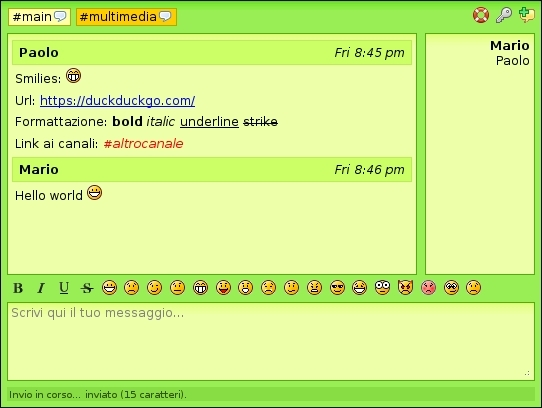
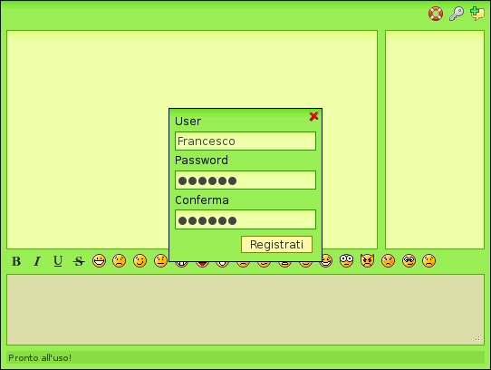
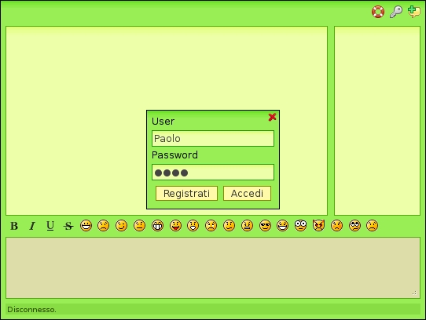
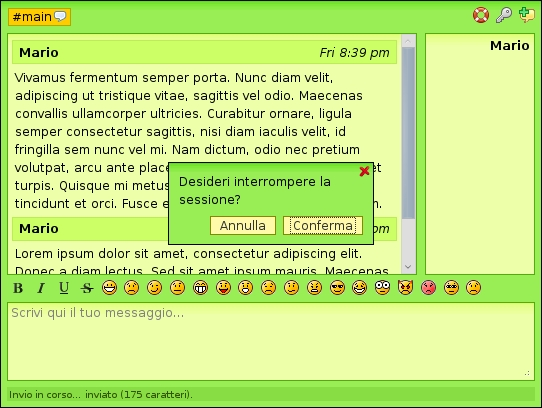

# 2013 - Guacamole (memories from my past)

My first and only IT project at the University of Pisa, after which I've decided to quit. No regrets.

It was 2013 and jQuery was the undisputed king of the web. This project includes a jQuery-like library of mine,
to provide DOM manipulation, AJAX requests, and other shit.

## Requirements

Technologies:

* HTML 4.01
* CSS 2.1
* JavaScript 1.3 con DOM Level 2
* PHP 5.1
* MySQL 5

Browsers:

* Mozilla FireFox 8.x
* Microsoft Internet Explorer 8-9.x

Forbidden use of non-standard objects/methods (i.e. `innerHTML`).

## Screenshots

